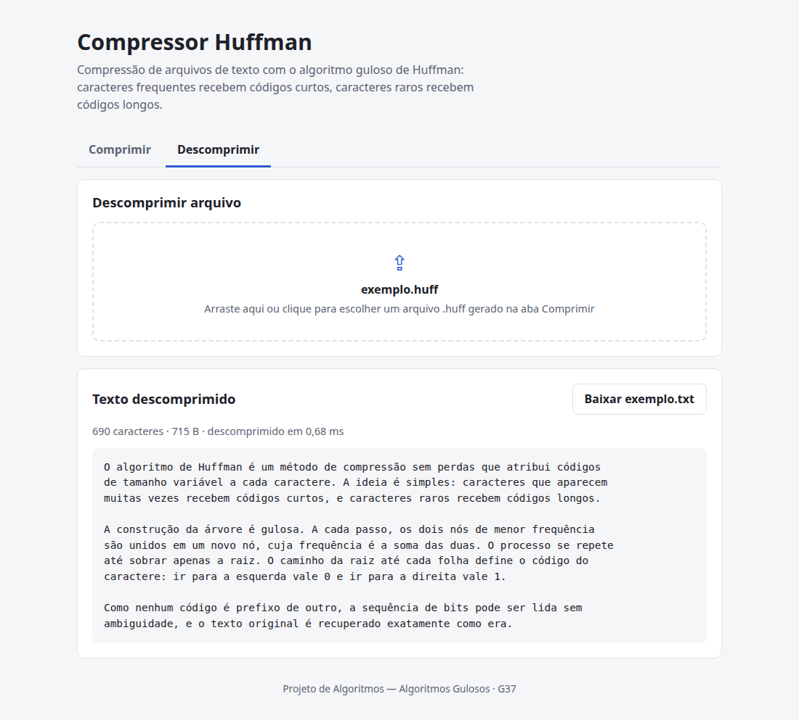

# Compressor de Arquivos — Huffman

Número da Lista: Algoritmos Gulosos<br>
Conteúdo da Disciplina: Algoritmos Gulosos — Codificação de Huffman<br>

## Alunos

| Matrícula | Aluno                       |
| --------- | --------------------------- |
| 222006276 | Luís Gustavo Lopes Oliveira |
| 222006211 | Vitor Valerio Hoffmann      |

## Sobre

Aplicação web que **comprime e descomprime arquivos `.txt`** usando o
algoritmo guloso de **Huffman**. O usuário sobe um arquivo de texto e recebe
de volta os dados comprimidos, a taxa de redução alcançada e as métricas de
execução do algoritmo.

**Como o problema foi modelado.** O texto é tratado como uma sequência de
caracteres, cada um com uma frequência de ocorrência. O Huffman constrói uma
**árvore binária** a partir dessas frequências: a cada passo, a escolha
gulosa junta os **dois nós de menor frequência** disponíveis num nó novo, até
sobrar um único nó — a raiz. O caminho da raiz até cada caractere (esquerda =
0, direita = 1) vira o código binário dele:

```text
caracteres frequentes  -> códigos curtos
caracteres raros       -> códigos longos
```

Como nenhum código é prefixo de outro, a sequência de bits pode ser lida de
volta sem ambiguidade. O texto codificado ocupa, no total, menos bits do que
os 8 bits por caractere do ASCII — mas só depois de **empacotar** essa
sequência de bits em bytes reais, de 8 em 8; gerar apenas uma string de
`'0'`s e `'1'`s não economiza espaço nenhum sozinha.

A árvore e os códigos são construídos por uma implementação própria do
**Huffman** (`backend/huffman_tree.py` e `backend/huffman_codec.py`), com fila
de prioridade e geração do código de cada caractere por percurso da árvore.

## Screenshots

**Comprimir** — métricas, comparação de tamanhos e tabela de códigos:


**Descomprimir** — recupera o texto original a partir do arquivo `.huff`:



A interface acompanha o tema do sistema (claro/escuro):


## Instalação

Linguagem: Python 3.9+<br>
Framework: FastAPI (backend) · React + Vite (frontend)<br>

**Pré-requisitos:** Python 3.9 ou superior e Node.js 18 ou superior.

```bash
# 1. ambiente virtual (evita o erro externally-managed-environment)
python3 -m venv venv
source venv/bin/activate      # no Windows: venv\Scripts\activate

# 2. dependências do backend
pip install -r backend/requirements.txt

# 3. sobe backend + frontend (na primeira vez roda o npm install sozinho)
python3 run.py
```

| Serviço  | Endereço                                                   |
| -------- | ---------------------------------------------------------- |
| Frontend | [http://localhost:5173](http://localhost:5173)             |
| API      | [http://127.0.0.1:8000](http://127.0.0.1:8000)             |
| Docs API | [http://127.0.0.1:8000/docs](http://127.0.0.1:8000/docs)   |

`Ctrl+C` encerra os dois. Sem Node.js instalado, o `run.py` sobe só o
backend, e dá para testar a API direto pela página `/docs`.

Para rodar o frontend separado:

```bash
cd frontend
npm install
npm run dev
```

O frontend procura a API em `http://127.0.0.1:8000`. Para usar outro
endereço, copie `frontend/.env.example` para `frontend/.env` e ajuste
`VITE_API_URL`.

## Uso

1. Na aba **Comprimir**, arraste ou escolha um arquivo `.txt` (UTF-8).
2. Veja as **métricas** (tamanhos, taxa de compressão, tempo) e a **tabela de
   códigos**: cada caractere com sua frequência, seu código e quantos bits
   ocupa no total.
3. Clique em **Verificar descompressão** para conferir que o texto volta
   idêntico ao original.
4. Clique em **Baixar `.huff`** para salvar o arquivo comprimido.
5. Na aba **Descomprimir**, envie o `.huff` e baixe o `.txt` original de
   volta.

O `.huff` é um JSON com os dados comprimidos (base64), a tabela de códigos,
os bits de preenchimento e o nome do arquivo original. A tabela é
essencial: sem ela não há como saber qual caractere cada código representa,
por isso ela é guardada junto com os dados.

### As métricas

| Métrica                       | O que é                                                                     |
| ----------------------------- | --------------------------------------------------------------------------- |
| Tamanho original / comprimido | Bytes antes (texto em UTF-8) e depois da compressão (só os dados).          |
| Taxa de compressão            | Percentual de redução alcançado.                                            |
| Tempo de cálculo              | Tempo só do algoritmo (frequências + árvore + codificação + empacotamento). |

A taxa de compressão varia bastante conforme o texto: em textos com
caracteres muito repetidos, o Huffman reduz bastante o tamanho; em textos com
distribuição de frequência quase uniforme, a economia é pequena — no limite,
se todos os caracteres aparecerem com a mesma frequência, o código gerado se
aproxima de um código de tamanho fixo.

O tamanho comprimido conta **só os dados**, não a tabela de códigos. Em
textos muito curtos, somando a tabela, o resultado pode até ficar maior que o
original.

## Outros

### A API

**`POST /comprimir`** — recebe um arquivo `.txt` (multipart/form-data, campo
`arquivo`) e devolve o resultado da compressão:

```bash
curl -X POST http://127.0.0.1:8000/comprimir \
  -F "arquivo=@exemplo.txt"
```

```json
{
  "dados_comprimidos_base64": "...",
  "codigos": { "a": "0", "b": "111", "...": "..." },
  "frequencias": { "a": 50, "b": 20, "...": "..." },
  "bits_de_preenchimento": 3,
  "tamanho_original_bytes": 230,
  "tamanho_comprimido_bytes": 65,
  "taxa_compressao_percentual": 71.7,
  "tempo_calculo_ms": 0.42
}
```

Devolve **400** se o arquivo não for `.txt`, estiver vazio ou não for UTF-8
válido.

**`POST /descomprimir`** — recebe em JSON os três campos devolvidos por
`/comprimir` necessários para reverter e devolve o texto original:

```bash
curl -X POST http://127.0.0.1:8000/descomprimir \
  -H "Content-Type: application/json" \
  -d '{"dados_comprimidos_base64": "...", "codigos": {"a": "0", "...": "..."}, "bits_de_preenchimento": 3}'
```

```json
{
  "texto": "abracadabra abracadabra...",
  "tempo_calculo_ms": 0.31
}
```

Devolve **400** se `dados_comprimidos_base64` não for base64 válido ou se os
dados não baterem com a tabela de códigos (arquivo corrompido ou editado).

### Estrutura do projeto

```text
backend/
├── huffman_tree.py     construção da árvore de Huffman e geração dos códigos
├── huffman_codec.py    compressão/descompressão (bits <-> bytes reais)
├── main.py             API FastAPI
└── requirements.txt
frontend/
├── src/
│   ├── api.js                  chamadas à API (/comprimir e /descomprimir)
│   ├── App.jsx                 página com as abas
│   ├── components/
│   │   ├── AbaComprimir.jsx    upload do .txt, métricas, tabela, download do .huff
│   │   ├── AbaDescomprimir.jsx upload do .huff e texto recuperado
│   │   ├── UploadArquivo.jsx   área de upload (clique ou arrastar)
│   │   ├── Metricas.jsx        cards e barras de comparação de tamanho
│   │   ├── TabelaCodigos.jsx   caractere, frequência, código, bits
│   │   └── ResultadoTexto.jsx  texto descomprimido + download do .txt
│   ├── utils/                  download de arquivos e formatação
│   └── index.css
└── package.json
docs/screenshots/       imagens usadas neste README
run.py                  sobe backend e frontend com um único comando
PLANO_FRONTEND.md       plano de ação seguido para construir o frontend
```

### Implementação

- **`huffman_tree.py`** — a classe `NoHuffman` (folha ou nó interno), a
  função `construir_arvore` (escolha gulosa: sempre junta os dois nós de
  menor frequência) e `gerar_codigos` (percurso da árvore que monta o
  código binário de cada caractere). A única estrutura de apoio é o `heapq`
  da biblioteca padrão. Quando o texto tem um único caractere distinto, é
  criada uma folha sentinela (caractere vazio) para que a árvore tenha dois
  ramos e o caractere receba um código de 1 bit.
- **`huffman_codec.py`** — `comprimir` troca cada caractere do texto pelo seu
  código e empacota os bits de 8 em 8 em bytes reais, completando o último
  byte com zeros (`bits_de_preenchimento`); `descomprimir` desempacota os
  bytes de volta em bits, descarta o preenchimento e lê os códigos bit a
  bit até reconstruir o texto original.

**Bibliotecas**: nenhuma biblioteca pronta de compressão (`zlib`, `gzip`,
etc.) é usada — toda a lógica de construção da árvore, codificação e
empacotamento dos bits é própria. **FastAPI** apenas serve a API e
**React** apenas monta a interface.

### Rodando a lógica separada da API

```bash
cd backend
python3 -c "
from huffman_codec import comprimir, descomprimir
texto = 'abracadabra abracadabra' * 10
r = comprimir(texto)
print(f'{r.tamanho_original_bytes} -> {r.tamanho_comprimido_bytes} bytes')
print('OK' if descomprimir(r.dados_comprimidos, r.codigos, r.bits_de_preenchimento) == texto else 'ERRO')
"
```

Isso testa a compressão/descompressão isoladamente, sem subir a API nem
precisar de um arquivo de verdade.
